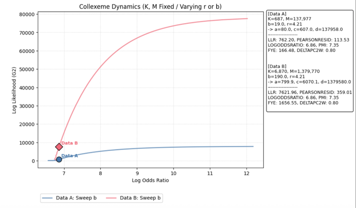
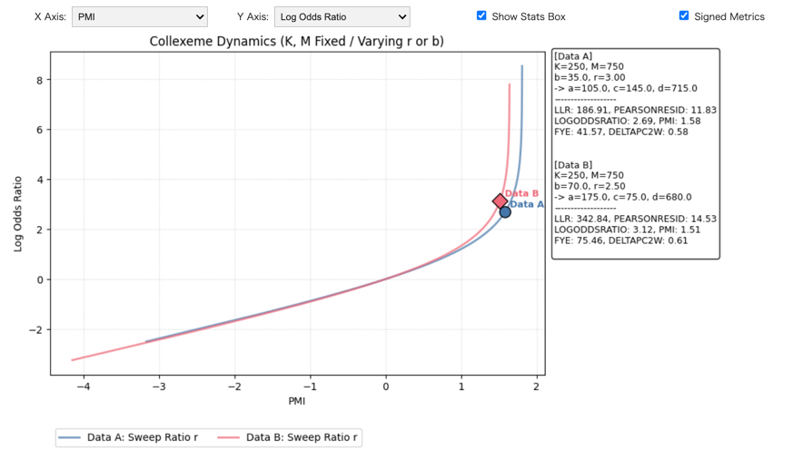
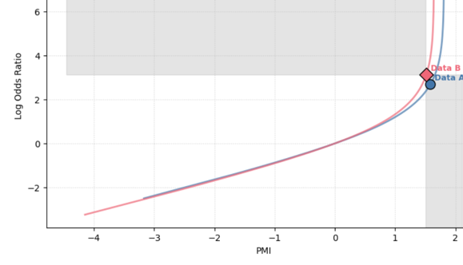

# Collostructional Analysis Simulator

This directory provides interactive simulators for collostructional analysis along with discussion notes on noteworthy phenomena observed within the framework.

1. Simulators

* Provides interactive tools to simulate association measures.
* Utilizes the computation scripts located in the core directory of this repository.

2. Discussion Notes

While the initial framework of collostructional analysis primarily used the p-value of a Fisher’s Exact Test, various other association measures have since been incorporated. This project focuses specifically on Pointwise Mutual Information (PMI) and the Log Odds Ratio (LOR), highlighting:

* Visualizing scenarios where LOR increases while PMI remains constant.
* Demonstrating the "Ranking Flip"—a phenomenon where the relative ranking of data points based on PMI is inverted when compared to the ranking based on LOR.

## Basic Functionality

We provide two simulators: `sim1.py` and `sim2.py`. Both allow users to manipulate four cell values in a contingency table. Specifically, they can visualize trajectories where one variable is varied while others remain constant (providing a rough yet functional visualization of trends).


### (1) `sim1.py`

This mode focuses on the "Target" rows and columns of a standard collostructional table.

* Variables:
    * `N`: Total Corpus Size
    * `C`: Construction Frequency
    * `W`: Word Frequency
    * `r`: Overlap Ratio (Percentage) (%) ... Simpson's Coefficient
* Trajectory Modes:
    * `Sweep Overlap` (fix `W`, vary `r`)
    * `Sweep Word Freq` (fix `r`, vary `W`)

### (2) `sim2.py`

This is the primary tool used for the case studies and theoretical discussions below.

* Variables:
    * `K`: Const Col 1 Total (a + c)
    * `M`: Const Col 2 Total (b + d)
    * `r`: Ratio (a / b)
    * `b`: Value b
* Trajectory Modes:
    * `Sweep Ratio r` (fix `b`, vary `r`)
    * `Sweep b` (fix `r`, vary `b`)


**Note on rounding effects:**
Although a, b, c, and d are computed as floating-point values, they are rounded to integers for association metric calculations. Consequently, the resulting trajectories may deviate slightly from those computed using floating-point arithmetic.


## Quick Start (Google Colab)

To run the simulators in a Google Colab environment:

* Upload the core script: Upload `core/collostructional_analysis.py` to your Colab session. 
    * *Note*: If you prefer to paste the code directly into a cell, remove the `import` statements that reference the `CollostructionalAnalysisMain` class.
* Upload the simulator(s) of your choice: Upload sim1.py, sim2.py, or both (depending on your needs), or paste their contents into a cell.
* Execute: Run the following code in a new cell:

For `sim1.py`：

```
sim = CollostructionalComparisonSimulatorNCWr()
sim.display()
```

For `sim2.py`：

```
sim = CollostructionalComparisonSimulatorKMbr()
sim.display()
```


## Theoretical Note: The PMI-LOR Behavior

### Definitions and Variables

We analyze the behavior of Pointwise Mutual Information (PMI) and Log Odds Ratio (LOR) when the corpus size $N$ and construction frequency $K$ are fixed. Let $M := N - K$. Let $r = a/b$ be the ratio of co-occurrence. We define two functions $f$ and $g$ (the values inside the logarithms) as follows:

* **PMI** is a function of $r$ only:

$$PMI(r) = \log_{2} f(r), \quad \text{where } f(r) = \frac{N \cdot r}{K \cdot (r+1)}$$

* **LOR** is a function of $r$ and $b$ :

$$LOR(r, b) = \ln g(r, b), \quad \text{where } g(r, b) = \frac{r(M-b)}{K-rb}$$

This simulator can visualize how LOR increases/decreases with $b$ even when the associative intensity ($r$) remains constant (provided $r \neq K/M$). 
**Refer to**: [Point 2](#point-2-fixed-ratio-r-variable-frequency-b) in Simulator Case Studies.

**Note**: At the neutral point ($r=K/M$), $f(r)=1$ and $g(r,b)=1$, meaning both PMI and LOR become 0. 
**Refer to**: [Point 1](#point-1-neutral-association-ad--bc) in Simulator Case Studies.

### Analysis of Derivatives

We consider the condition where all cells in the contingency table are positive ($a, b, c, d > 0$).
(Recall that $K=a+c$, $M=b+d$, and $N=a+b+c+d$).

Since logarithmic functions are strictly increasing, the increase/decrease of PMI and LOR are determined by the derivatives of $f$ and $g$:

1. **Derivative of $f(r)$**:
$$\frac{d f(r)}{d r} = \frac{N}{K (1 + r)^2} > 0 \quad (1)$$

(PMI is strictly increasing with $r$ for $r>0$.)

2. **Partial Derivative of $g(r, b)$ with respect to $r$**:

$$\frac{\partial g(r,b)}{\partial r} = \frac{K (M - b)}{(K - b r)^2} \quad (2)$$

(Since $a,b,c,d>0$, the numerator and denominator are positive. Thus, LOR is strictly increasing with $r$.)

3. **Partial Derivative of $g(r, b)$ with respect to $b$**:

$$\frac{\partial g(r,b)}{\partial b} = \frac{r (Mr - K)}{(K - b r)^2} \quad (3)$$

#### Interpretation of Eq (3)

The sign of the derivative in Eq (3) depends on the term $(Mr - K)$, which corresponds to the direction of association ($ad - bc$):

* Attraction Zone ($ad > bc$): The derivative is positive ($\frac{\partial g}{\partial b} > 0$).
* Repulsion Zone ($ad < bc$): The derivative is negative ($\frac{\partial g}{\partial b} < 0$).
* Neutral ($ad = bc$): The derivative is zero.

**Conclusion**:

In the Attraction Zone, LOR increases if either $r$ increases or $b$ increases.
Based on this theoretical understanding, we can now explore specific cases using the simulator.

---

## Simulator Case Studies

Use the interactive simulator `sim2.py` to verify these critical points:

### Point 1: Neutral Association ($ad = bc$)

* **Setup**: Set $r = K/M$ and use `sweep b` mode.
    * e.g., $K=2000, M=8000, r=0.25$
* **Observation**: Theoretically, PMI and LOR converge to 0. (Note: Small fluctuations near 0 may occur due to the calculation process).

### Point 2: Fixed Ratio ($r$), Variable Frequency ($b$)

* **Setup**: Set $r \neq K/M$ and select sweep b.
    * e.g., $K=2000, M=8000, r=0.3$
    * Note: Depending on the specific values, the plot trajectory may exhibit slight jitter. We recommend testing with values near $K/M$ for smoother visualization.
* **Observation**: Observe that **PMI remains a flat line** while **LOR changes**. 

### Point 3: Scale Variance and Invariance

Gries (2019) argues that when all values in a contingency table are scaled by a factor of 10, measures such as LLR ($G^2$) change significantly, while other measures (<i>"such as $MI$ or the log odds ratio"</i> (Gries, 2019:389)) remain stable. 
We can verify the behavior of these measures under scaling conditions.

* **Setup 1**: Intended to Replicate Table 2 from Gries (2019). Observe how the metrics react when the sample size is scaled 10x while maintaining the same ratio ($r$).
    * Data A: $K=687, M=137977, b=19, r=4.21$
    * Data B: $K=6870, M=1379770, b=190, r=4.21$

* **Observation 1**:
    * **Notation**: Since the ratio $r$ is derived from $607/19$, using $r=4.21$ is an approximation. 
    Consequently, Data B is not a strict 10x scale of Data A (e.g., $c=607$ vs. $c=6071$ in the calculation process). 
    While the LLR values for Data B may differ slightly from the original paper, it remains observable that **PMI and LOR** are consistent, whereas **LLR ($G^2$), PEARSONRESID, and FYE** scale drastically.

<div align="center" style="text-align: center; width:80%">

Figure 1 Scale Variance and Invariance - LOR vs. LLR
</div>

* **Setup 2**: A strict 10x scaling of all cells ($a, b, c, d$). Observe how the metrics react when the sample size is scaled 10x while maintaining the same ratios ($r$).
    * Data A: $K=2500, M=7500, b=1000, r=0.5$
    * Data B: $K=25000, M=75000, b=10000, r=0.5$
* **Observation 2**: 
    * PMI and LOR show the same values (PMI=0.42, LOR=0.49).
    * LLR ($G^2$), PEARSONRESID, and FYE show significant variance:
        * Data A: LLR=62.05, PEARSONRESID=6.45, FYE=14.67
        * Data B: LLR=620.53, PEARSONRESID=20.41, FYE=136.45
    <!-- Observe that "Stats Box"の中に表示されたLOR, PMIは同じでLLR, PEARSONRESID, FYEは異なる。-->


### Point 4: Ranking Flip (PMI - LOR)

While both PMI and LOR are scale-invariant (as shown in Point 3), the ranking derived from their values do not always coincide. This simulator identifies the exact conditions where these two association measures disagree.

Observe the ranking of Data A and Data B in the following two setups:

* Setup1: Set $K=250, M=750$ (25% Density). Compare:
    * Data A: $b=35, r=3.00$ ($\to a=105$)
    * Data B: $b=70, r=2.50$ ($\to a=175$)

* Setup2: Set $M=K=5000$ (50% Density). Compare:
    * Data A: $b=120, r=3.00$ ($\to a=360$)
    * Data B: $b=1200, r=2.50$ ($\to a=3000$)

* **The Result**:

| Measure | Ranking |
| ---- | ---- |
| **LOR / LLR / PEARSONRESID / FYE** | **A < B** |
| **PMI** | **A > B** (Flip!) |

* Setup1: 
    * Data A: $PMI=1.58, LOR=2.69, LLR=186.91, PEARSONRESID=11.83, FYE=41.57,$
    * Data B: $PMI=1.51, LOR=3.12, LLR=342.84, PEARSONRESID=14.53, FYE=75.46,$

<div align="center" style="text-align: center; width:80%">


Figure 2 Setup1: PMI vs. LOR



Figure 3 Setup1: PMI vs. LOR - Ranking Inconsistency Regions
</div>

**Visualizing the Inconsistency (Figure 2 and Figure 3)**
In Figure 3, the shaded areas represent the "Ranking Inconsistency Regions" relative to Data B:
* Area 1 (Bottom-Right): Contains data points where the PMI is higher than Data B, but the LOR is lower. Data A falls exactly into this region.
* Area 2 (Top-Left): Contains data points where the PMI is lower than Data B, but the LOR is higher.


* **Conclusion**: The choice of measure can **flip the ranking** of linguistic constructions. This proves that PMI and LOR are not globally order-preserving.

* **Discussion**: 
    * Gries (2022:22) shows a high correlation ($R^2_{GAM} = 0.9974$) between "log odds ratio" and "MI-score" in the Figure 8 of the paper. However, our simulation proves they do not necessarily provide the same ranking. Consequently, it may be beneficial for researchers to consider the specific properties of their data when selecting an appropriate measure.
    * The condition $K=250, M=750$ implies that the target construction constitutes 25% of the corpus, while $M=K=5000$ implies a 50% density. (Note: Due to mathematical symmetry, this calculation holds regardless of whether the target is a construction or a word).
    * While such high frequency might seem unrealistic for general corpora, this scenario is possible when performing an analysis within a specific sub-corpus, or when treating the occurrences of a specific construction as the total dataset to examine associations between a specific sub-construction and occurring words.


## How to Reproduce the Flip in the Simulator

You can manually reproduce the ranking flip by manipulating the marginal frequency $b$ to adjust the LOR (Y-axis) independent of PMI (X-axis).

1.  **Axis Setup**: Set X-Axis to `PMI` and Y-Axis to `Log Odds Ratio`.
2.  **Fix Constants**: Set identical $K$ and $M$ for both Data A and B to create a shared baseline (e.g., $K=2500, M=7500$).
3.  **Separate on X-Axis**: Set distinct $r$ values to separate the points horizontally.
    * e.g., Data A ($r=2.5$) vs. Data B ($r=2.0$). At this stage, Data A is to the right of Data B (Higher PMI).
4.  **Flip on Y-Axis**: Use `Sweep b` mode. Increase the $b$ value for Data B (the lower PMI point).
    * Since $\frac{\partial LOR}{\partial b} > 0$ in the attraction zone, Data B will move vertically upwards.
    * By setting $b_A=800$ and $b_B=1200$, Data B's LOR surpasses Data A's, completing the flip.


## References

- Gries, Stefan Th. 2019. 15 years of collostructions. <i>International Journal of Corpus Linguistics</i>, 24(3), 385–412.
- Gries, Stefan Th. 2022. What do (most of) our dispersion measures measure (most)? Dispersion? <i>Journal of Second Language Studies</i>, 5(2), 171–205.
- Gries, Stefan Th. 2023. Overhauling Collostructional Analysis: Towards More Descriptive Simplicity and More Explanatory Adequacy. <i>Cognitive Semantics</i> 9(3): 351–386.
- Gries, Stefan Th. 2024. Coll.analysis 4.1. A script for R to compute perform collostructional analyses. <https://www.stgries.info/teaching/groningen/index.html>.
- Stefanowitsch, Anatol and Stefan Th. Gries. 2003. Collostructions: investigating the interaction between words and constructions. <i>International Journal of Corpus Linguistics</i> 8(2): 209–243.


---

## Navigation

- [Top-level README](../README.md)


